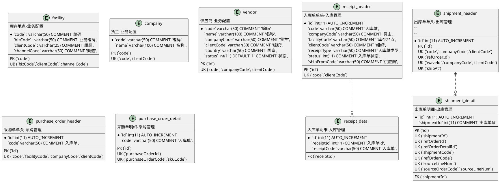

### Section X

```plantuml
@startuml


entity "facility" as facility {
  库存地点-业务配置
  --
  * `code` : varchar(50) COMMENT '编码'
  `bizCode` : varchar(50) COMMENT '业务编码',
  `clientCode` : varchar(25) COMMENT '组织',
  `channelCode` varchar(50) COMMENT '渠道',
  --
  PK (`code`)
  UB (`bizCode`,`clientCode`,`channelCode`)
}

entity "company" as company {
  货主-业务配置
  --
  * `code` varchar(50) COMMENT '编码'  
  `name` varchar(100) COMMENT '名称',
  --
  PK (`code`)
  UK (`code`,`clientCode`)
}

entity "vendor" as vendor {
  供应商-业务配置
  --
  * `code` varchar(50) COMMENT '编码'  
  `name` varchar(100) COMMENT '名称',
  `companyCode` varchar(50) COMMENT '货主',
  `clientCode` varchar(50) COMMENT '组织',
  `country` varchar(50) COMMENT '国家',
  `status` int(11) DEFAULT '1' COMMENT '状态',
  --
  PK (`id`)
  UK (`code`,`companyCode`,`clientCode`)
}

entity "receipt_header"  as receipt_header {
  入库单单头-入库管理
  --
  * `id` int(11) AUTO_INCREMENT
  `code` varchar(50) COMMENT '入库单',
  `companyCode` varchar(50) COMMENT '货主',
  `facilityCode` varchar(50) COMMENT '库存地点',
  `clientCode` varchar(50) COMMENT '组织',
  `receiptType` varchar(50) COMMENT '入库单类型',
  `status` int(11) COMMENT '入库单状态',
  `shipFromCode` varchar(50) COMMENT '供应商',  
  --
  PK (`id`)
  UK (`code`,`clientCode`)
}

entity "receipt_detail" as receipt_detail {
  入库单明细-入库管理
  --
  * `id` int(11) AUTO_INCREMENT
  `receiptId` int(11) COMMENT '入库单id',
  `receiptCode` varchar(50) COMMENT '入库单',
  --
  FK (`receiptId`)
}

entity "purchase_order_header" as purchase_order_header {
  采购单单头-采购管理
  --
  * `id` int(11) AUTO_INCREMENT
  `code` varchar(50) COMMENT '入库单',
  --
  PK (`id`)
  UK (`code`,`facilityCode`,`companyCode`,`clientCode`)
}

entity "purchase_order_detail" as purchase_order_detail {
  采购单明细-采购管理
  --
  * `id` int(11) AUTO_INCREMENT
  `code` varchar(50) COMMENT '入库单',
  --
  PK (`id`)
  UK (`purchaseOrderId`)
  UK (`purchaseOrderCode`,`skuCode`) 
}


entity "shipment_header" as shipment_header {
 出库单单头-出库管理
  --
  * `id` int(11) AUTO_INCREMENT
  --
  PK (`id`)
  UK (`code`,`companyCode`,`clientCode`)
  UK (`refOrderId`)
  UK (`waveId`,`companyCode`,`clientCode`)
  UK (`shipAt`)
}


entity "shipment_detail" as shipment_detail {
  出库单明细-出库管理
  --
  * `id` int(11) AUTO_INCREMENT
  `shipmentId` int(11) COMMENT '出库单Id'
  --
  PK (`id`)
  UK (`shipmentId`)
  UK (`refOrderId`)
  UK (`refOrderDetailId`)
  UK (`shipmentCode`)
  UK (`refOrderCode`)
  UK (`sourceLineNum`)
  UK (`sourceOrderCode`,`sourceLineNum`)
  --
  FK (`shipmentId`)
}


receipt_header ||..o{ receipt_detail
shipment_header ||..o{ shipment_detail


@enduml
```

KFC-ADMIN
123