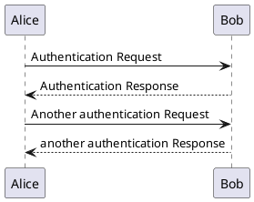

### Section X

@startuml

' hide the spot
hide circle

' avoid problems with angled crows feet
skinparam linetype ortho

entity "Entity01" as e01 {
*e1_id : number <<generated>>
--
*name : text
description : text
}

entity "Entity02" as e02 {
*e2_id : number <<generated>>
--
*e1_id : number <<FK>>
other_details : text
}

entity "Entity03" as e03 {
*e3_id : number <<generated>>
--
e1_id : number <<FK>>
other_details : text
}

e01 ||..o{ e02
e01 |o..o{ e03

@enduml

